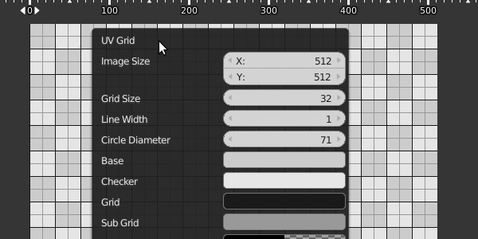
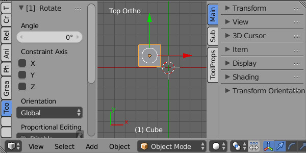
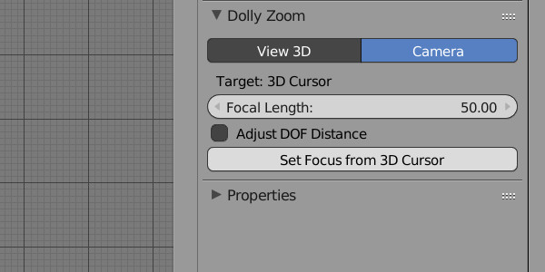
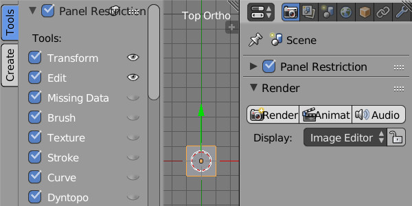
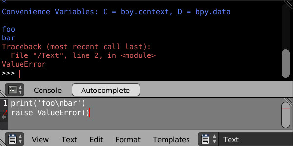
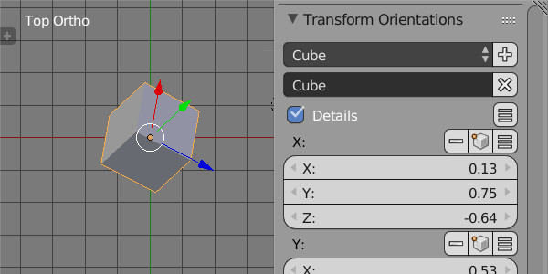
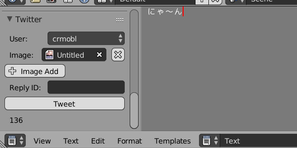
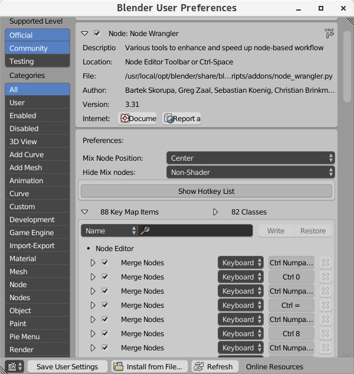

# Blender Addon 'CTools'

下記の機能をまとめたアドオン

## Edit Mesh Draw Nearest
マウスクリックで次に選択するであろう要素を強調表示する。  


## Lock Coordinates
頂点の移動、選択を抑制する。  


## Lock 3D Cursor
マウスクリックでの3Dカーソル移動を禁止する。以前コミットされ、その後消されたものをアドオンで再現。  


## Mouse Gesture
マウスジェスチャー。  


## Overwrite Builtin Images
スプラッシュとアイコン画像を変更するアドオン(Linux専用)。  
同梱のoverwrite_builtin_images.pyはバイナリに埋め込まれた画像を書き換えるスクリプト(Windows/Linux)。  


## QuadView Move
マウスドラッグでQuadView境界を移動する。  


## Region Ruler
3DView、ImageEditor、NodeEditorにRulerを表示する。  
)

## Screencast Keys Mod
[Screencast Key Status Tool](http://wiki.blender.org/index.php/Extensions:2.6/Py/Scripts/3D_interaction/Screencast_Key_Status_Tool "Screencast Key Status Tool")をオペレータ実行中のイベントも取得出来るように勝手に改造したもの。  


## Update Tag
マテリアルやテクスチャのドライバーの値が変更された際に3DViewを更新する。

## List Valid Keys
現在アクティブなAreaとRegionで有効なショートカットの一覧を標準出力かTextへ出力する。  


## Quick Boolean
四角形、円形等でメッシュを切り抜く。ObjctModeとEditModeで利用可。  


## Splash Screen
起動時のスプラッシュスクリーンを置換する。  
履歴一覧はダブルクリックでファイルをロードする。画像の変更と、画像クリックで指定ディレクトリの音声ファイルを再生する機能あり。  
※ PyQt5のインストールが必要。  


## Align Tools
頂点やオブジェクト等を整列する。  

## Emulate Key Map
スペースキーと特定キーの組み合わせで、テンキーに割り当てられたオペレーターを実行する。  
Shift + Space の後、入力されたキーに対応したオペレーターを実行する。  

## Make UV Grid
単純なUV Grid 画像を作成する。  
※ [Pillow](https://python-pillow.org)のインストールが必要。  


## Region Panel Categories
アクティブなタブの取得と切り替えの為、bpy.types.Regionにpanel_categoriesとactive_panel_category属性を追加する。  
linuxでのみ動作する。

## File Browser Confirm
画像を上書きする時にダイアログを表示する。

## Edit Panel Category
Panelのcategory(タブ名)を変更する。  


## Dolly Zoom
CAMERA表示の際、焦点距離変更時に表示領域を維持するようにカメラを前後にする。  
ORTHO,PERSPの場合はSpaceView3D.view_distanceを調整する。  
View Navigation にこの機能を追加したもの -> View Navigation EX (Ctrl + Shift + F)。  


## System Sound
特定のアクションの時に、UserPreferencesで設定したフォルダにある音声ファイルをランダムで一つ選んで再生する。  
* 起動
* 終了
* blendファイルの読み込み
* blendファイルの保存(AutoSaveを含む)
* スタートアップファイルの再読み込み(Ctrl+N)
* UserPreferences画面の表示(Ctrl+Alt+U)

終了時の音声(Power Off Post)は再生終了までユーザーからの入力を一切受け付けなくなるので注意。

## Panel Restriction
任意のパネルを非表示にする。  
設定はファイルに保存される。  


## StdOut to Python Console
sys.stdoutとsys.stderrを変更して、pythonの標準出力と標準エラー出力をPythonConsoleにも出力する。  
※SyntaxErrorのエラー出力には対応していない。  


## Transform Orientation Editor
作成した Transform Orientation を編集する。  


## Tweet B3D
Twitterに投稿する。  


## その他
### __patch/ui_layout_box.patch
alignが真の状態のUILayoutでbox描画に不具合が起こる問題を修正するパッチ。  
適用前:  
  
適用後:  


### 2.78/scripts
既存のファイルを上書きして動作を変える。

#### 2.78/scripts/modules/bpy/utils/\_\_init\_\_.py  
好きなだけアドオンのディレクトリを増やせる。  
自分で書いた物、ダウンロードした物とかでディレクトリを分けたい場合等に。

* 設定方法  
ディレクトリのパスを記述した`addons.pth`というファイルをユーザーのconfigディレクトリに保存する。

    例:
    
    ```
    # /home/hoge/.config/blender/2.78/config/addons.pth
    
    ../scripts/addons/addons_subdir
    ../scripts/addons_dev
    ```

* ユーザーのconfigディレクトリはblenderのPythonConsoleで以下の様にして確認できる。  

    ```
    >>> bpy.utils.user_resource('CONFIG')
    '/home/hoge/.config/blender/2.78/config/'
    ```

* その他  
    `bpy.utils.script_paths()`の返り値に任意のパスを加えたい場合は同じように`scripts.pth`を作成する。  
    `bpy.utils.script_paths('addons_contrib')`の場合は`addons_contrib.pth`、`bpy.utils.script_paths('modules')`なら`modules.pth`といったファイルを作成する。

#### 2.78/scripts/startup/bl_ui/space_userpref.py  
UserPreferencesのaddonの検索ボックスで、パスの区切り文字(linuxなら/)の後に正規表現でパターンを入力するとファイル名でフィルタリング出来る。  

#### 2.78/scripts/modules/addon_utils.py, 2.78/scripts/modules/_addon_register_info.py  
UserPreferencesでのaddon詳細表示で、addonが追加するショートカット・クラス・パネルを表示する。  
ショートカットとパネルの属性の変更が可能。Write(Restore)を押した後に Save User Settings で保存される。

